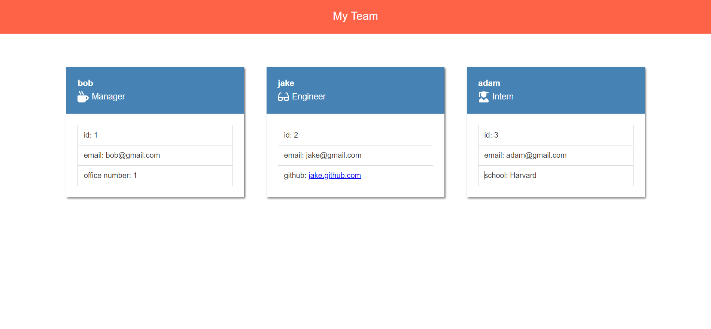

# Team-Profile-Generator

## Description

This is a command line application that generates a team profile HTML page.

here is a video on how to use the application https://drive.google.com/file/d/1IV0XfsCLo4clOTwV2sGtriDwvOhtwYZE/view

## Table of Contents

- [Installation](#Installation)
- [Usage](#Usage)
- [License](#License)
- [Questions](#Questions)

## Installation

To install run npm i in the command line. Next run node index.js to invoke the prompts.

## Usage

Follow along with the prompts to build your team.

## License

MIT

## Questions

For additional information please contact me via GitHub at [https://github.com/codeb-a](https://github.com/codeb-a) or via email at [brandonakers729@gmail.com](mailto:brandonakers729@gmail.com?subject=[GitHub]%README%Generator).
